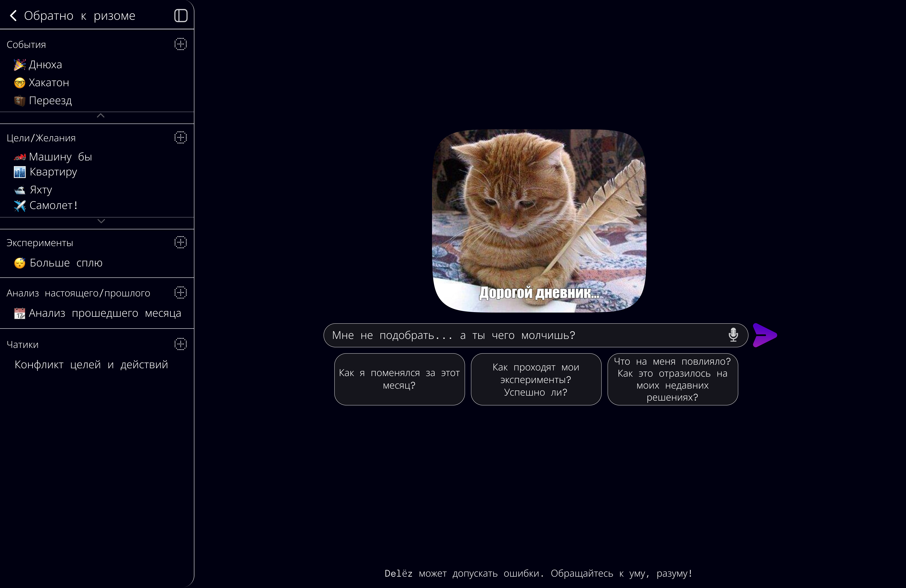
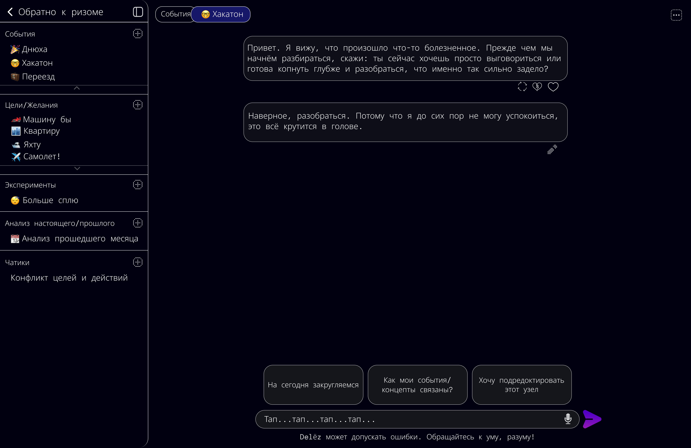

## **Что по итогу показываем**

**Если коротко:** у нас есть история жизни пользователя с 300 записями и мы будем показывать как Delёz с лёгкостью в них ориентируется и находит связанные события во время общения с пользователем, благодаря чему решает следующую проблему:\
Ты анализируешь события: конфликт с партнёром, критика на работе, новая идея. После приходишь к выводам, но выводы быстро исчезают из памяти -- остаются только на бумажке (если записал конечно).

Через время новая ситуация повторяется. Ты чувствуешь, что это похоже на то, что было раньше, но не помнишь, что ты тогда выучил. Ты обращаешься к ИИ для совета. Но ИИ не знает твою историю. Он не видит, что 5 лет назад был похожий конфликт, что ты тогда что-то понял, что ты уже трансформировался. Каждый раз ИИ даёт шаблонный совет, как для любого. Его ответ не учитывает твой путь, не видит, как ты изменился, почему старые решения уже не подходят для нового тебя.

**Результат**: Твоя жизнь -- это серия отдельных событий. Они не связаны между собой. Твой опыт не развёртывается в новые ситуации. Урок из прошлого не помогает в настоящем, потому что никто не показывает тебе их связь -- линию твоего развития, куда ты пришёл и куда движешься дальше. Ты остаёшься в цикле: событие -> боль -> забывчивость -> событие -> боль -> сначала.

---

## **300 записей = 2 года жизни**

📅 Март 2024:     Конфликт с партнёром

📅 Июль 2024:     Конфликт с партнёром (снова)

📅 Ноябрь 2025:   Конфликт с партнёром (в третий раз)

-  *мб расстаться)*

## **Пользователь спрашивает:**

"Почему я так реагирую на критику?"

---

## **Delёz за 2-3 секунды:**

1. **Находит** все 3 события в 300-записной истории

2. **Видит** эволюцию:

   -  Март: Обида 8/10 -> Я уходил

   -  Июль: Обида 6/10 -> Я просил паузу

   -  Ноябрь: Обида 5/10 -> Я готов обсудить

3. **Говорит:** "Ты ЭВОЛЮЦИОНИРОВАЛ))). Раньше бежал, сейчас остаёшься и готов внятно обсудить всё. Это потому что прошлый опыт так то так то на тебя повлиял))"

---

## **WOW жюри:**

"Откуда система это узнала?!" - рил

**Ответ:**

-  ✅ **RAG**: Нашёл события (Hybrid Search)

-  ✅ **Neo4j**: Связал их (граф за 2 года)

-  ✅ **CoT**: Проанализировал (цепочка рассуждений)

-  ✅ **GigaChat Max**: Рассказал про трансформацию

**Результат:** Личный ИИ-аналитик, а не ChatGPT.

---

**Почему это мощно? йоу**

| **Что видят**            | **Что это означает**                   |
|--------------------------|----------------------------------------|
| 300 записей ← работает   | Масштабируется на тысячи               |
| События за 2 года        | Долгосрочная память работает           |
| Связь март->июль->ноябрь | Система видит паттерны, не случайности |
| Показана эволюция        | ИИ видит ЛИЧНОСТЬ, не просто события   |
| Быстро (2-3 сек)         | Production-ready архитектура           |

**Какие страницы нам для этого нужны**

**Страница чата с ИИ:**

{width=6048px height=3928px}

**Главная страница:**

{width=6048px height=3928px}