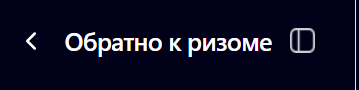
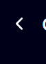

* [ ] Уменьшить ширину линий (обводки), для бокового sidebar и поля ввода сообщений. [**Чтобы она была как на макете**](https://www.figma.com/design/PXEtmG2OwJFxw6k60wvIcG/%D0%94%D0%BB%D1%8F-%D0%94%D0%B0%D1%88%D0%B8?node-id=1-14&t=o7yMHSk3Kmc4Bb4W-0)

* [ ] Переместить, пониже надпись ‘Delёz может допускать ошибки. Обращайтесь к уму, разуму!‘. [**Чтобы она была как на макете**](https://www.figma.com/design/PXEtmG2OwJFxw6k60wvIcG/%D0%94%D0%BB%D1%8F-%D0%94%D0%B0%D1%88%D0%B8?node-id=1-14&t=o7yMHSk3Kmc4Bb4W-0)

* [ ] **Это выровнять**. [**Чтобы она была как на макете**](https://www.figma.com/design/PXEtmG2OwJFxw6k60wvIcG/%D0%94%D0%BB%D1%8F-%D0%94%D0%B0%D1%88%D0%B8?node-id=1-14&t=o7yMHSk3Kmc4Bb4W-0)**:**

   {width=359px height=90px}

* [ ] Также под ней добавить линию.  [**Чтобы она была как на макете**](https://www.figma.com/design/PXEtmG2OwJFxw6k60wvIcG/%D0%94%D0%BB%D1%8F-%D0%94%D0%B0%D1%88%D0%B8?node-id=1-14&t=o7yMHSk3Kmc4Bb4W-0)

* [ ] Подгрузить шрифты, чтобы надписи[ **были как на макете**](https://www.figma.com/design/PXEtmG2OwJFxw6k60wvIcG/%D0%94%D0%BB%D1%8F-%D0%94%D0%B0%D1%88%D0%B8?node-id=1-14&t=o7yMHSk3Kmc4Bb4W-0)

* [ ] Сделать чтобы при наведении эта стрелка не становилась черной:

   {width=67px height=92px}