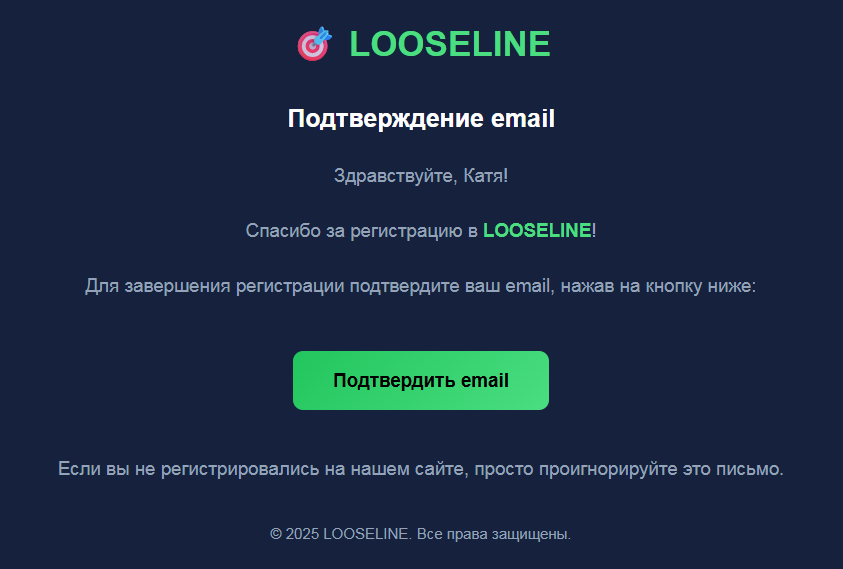

Реализуй подтверждение аккаунта по email, после его регистрации. Уведомление должно приходить на почту, для этого **используй SMTP от Mail**.

**Адрес почты**: [delez.ai@mail.ru](mailto:delez.ai@mail.ru)

**Пароль**: VvFgJPKNDQUv6CDo6pbp

:::lab 

**ВАЖНО, эти данные напрямую не подставляй в коде!!! Они должны подтягиваться из .env.**

:::

**Вот пример как они могут лежать в .env:**

{width=429px height=153px}

### **Уведомление должно приходить в таком стиле:**

{width=843px height=569px}

## **На видео показано то как это должно работать:**

[Подтверждение email - Trim.mp4](<./Подтверждение email - Trim.mp4>)

:::note 

Ошибки пользователю, должны быть видны на русском!

:::