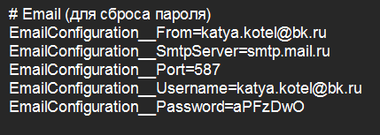
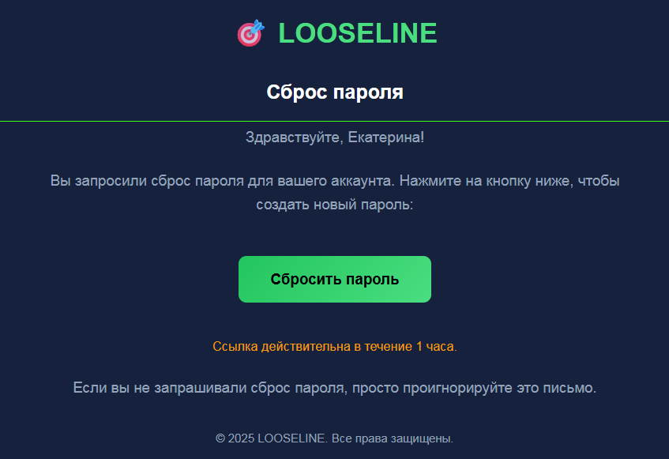

Реализуй сброс пароля (**возможно это тоже по умолчанию есть в better-auth**). После запроса на сброс, должно приходить уведомление на почту, для этого **используй SMTP от Mail**.

**Адрес почты**: [delez.ai@mail.ru](mailto:delez.ai@mail.ru)

**Пароль**: VvFgJPKNDQUv6CDo6pbp

:::lab 

**ВАЖНО, эти данные напрямую не подставляй в коде!!! Они должны подтягиваться из .env.**

:::

**Вот пример как они могут лежать в .env:**

{width=429px height=153px}

### **Уведомление должно приходить в таком стиле:**

{width=847px height=581px}

## **То как это должно работать:**

Нажимаем «Забыли пароль?» -> Вводим email -> Переходим на почту -> Вводим новый пароль -> Перекидывает на страницу входа

:::note 

Ошибки пользователю, должны быть видны на русском!

:::